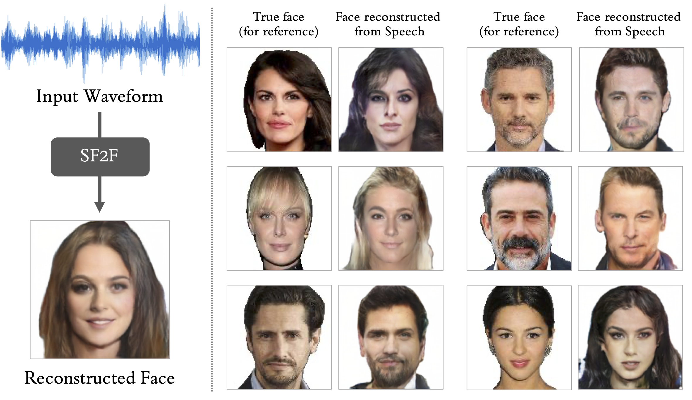
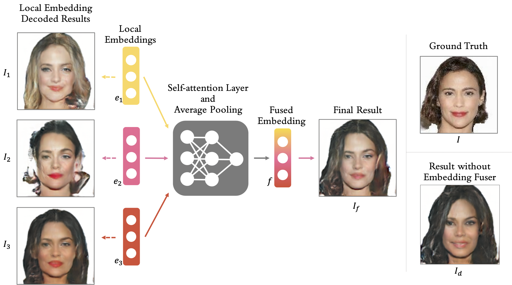

# ACMMM '22: Speech Fusion to Face: Bridging the Gap Between Human's Vocal Characteristics and Facial Imaging

This is the officical PyTorch implementation for the paper *Speech Fusion to Face: Bridging the Gap Between Human's Vocal Characteristics and Facial Imaging*.

The main paper of this work is published on ACMMM 2022 as a full paper [[acmdl](https://dl.acm.org/doi/10.1145/3503161.3547850)][[arxiv](https://arxiv.org/abs/2006.05888)]. Please refer to our [supplementary material](https://sf2f.github.io/) for more information about this paper.

[](https://github.com/BAI-Yeqi/SF2F_PyTorch/blob/main/LICENSE)
[](https://github.com/SF2F/SF2F_PyTorch/issues)
[](https://github.com/BAI-Yeqi/SF2F_PyTorch/blob/main/README.md)



## Released Models

We release low resolution and mid resolution versions of SF2F. Our baseline model, voice2face ([paper](https://proceedings.neurips.cc/paper/2019/file/eb9fc349601c69352c859c1faa287874-Paper.pdf)) which generates low resolution images by default, is also released. All released implementations are designed and experimented on HQ-VoxCeleb dataset.

|    Model                                                    | Output Resolution | VGGFace Score    |
|:-----------------------------------------------------------:|:-----------------:|:----------------:|
| [voice2face](https://github.com/SF2F/SF2F_PyTorch/tree/main/options/vox/baseline/v2f.yaml)               | 64 $\times$ 64    | 15.47 $\pm$ 0.67 |
| [SF2F (no fuser)](https://github.com/SF2F/SF2F_PyTorch/tree/main/options/vox/sf2f/sf2f_1st_stage.yaml)     | 64 $\times$ 64    | 18.59 $\pm$ 0.87 |
| [SF2F](https://github.com/SF2F/SF2F_PyTorch/tree/main/options/vox/sf2f/sf2f_fuser.yaml)                    | 64 $\times$ 64    | 19.49 $\pm$ 0.59 |
| [SF2F (no fuser)](https://github.com/SF2F/SF2F_PyTorch/tree/main/options/vox/sf2f/sf2f_mid_1st_stage.yaml) | 128 $\times$ 128  | 19.31 $\pm$ 0.65 |
| [SF2F](https://github.com/SF2F/SF2F_PyTorch/tree/main/options/vox/sf2f/sf2f_mid_fuser.yaml)                | 128 $\times$ 128  | 20.10 $\pm$ 0.47 |

Instructions on the training and testing of above models are introduced in [GETTING_STARTED](./GETTING_STARTED.md).

## Implementation Details

To provide the users of this repo a better understand of our implementation, we hereby introduces the implementation of key modules.

**Voice Encoders.** The baseline voice encoder from voice2face is implemented as `V2F1DCNN` in `models/voice_encoders.py`. As mention in our main paper, we designed and implemented `Inception1DBlock` to improve the performance of voice encoder. When parameter `inception_mode` is set to `True`, `V2F1DCNN` is automatically built up with `Inception1DBlock`, which results in our proposed 1D-Inception based voice encoder. ([Jump to code](./models/voice_encoders.py#L266))

**Face Decoders.** The baseline face decoder is implemented as `V2FDecoder` in `models/face_decoders.py`. Our enhanced face decoder is implemented as `FaceGanDecoder` in the same file. ([Jump to code](./models/face_decoders.py#L390))

**Embedding Fuser.** Our proposed attention fuser is implemented as `AttentionFuserV1` in `models/fusers.py`. A graphical demonstration of embedding fuser is shown below. ([Jump to code](./models/fusers.py#L20))



**Generative Models.** All generative models in this repo are implemented as `EncoderDecoder` in `models/encoder_decoder.py`. Encoder, decoder, and fusers will be initialized as attributes of `EncoderDecoder` class. ([Jump to code](./models/encoder_decoder.py#L20))

**FaceNet Perceptual Loss.** FaceNet perceptual loss is implemented as `FaceNetLoss` in `models/perceptual.py`. ([Jump to code](./models/perceptual.py#L13))

**VGGFace Score.** VGGFace Score is implemented in `scripts/compute_vggface_score.py`. ([Jump to code](./scripts/compute_vggface_score.py#L219))

**Retrieval Metrics.** Retrieval metrics are implemented in `utils/s2f_evaluator.py`. ([Jump to code](./utils/s2f_evaluator.py#L35))

## Getting Started
To learn about environment setup, data preparation, launch of training, visualization, and evaluation, please refer to [GETTING_STARTED](./GETTING_STARTED.md).

## Citation
If you find this project useful in your research, please consider cite:
```
@inproceedings{bai2022speech,
  title={Speech Fusion to Face: Bridging the Gap Between Human's Vocal Characteristics and Facial Imaging},
  author={Bai, Yeqi and Ma, Tao and Wang, Lipo and Zhang, Zhenjie},
  booktitle={Proceedings of the 30th ACM International Conference on Multimedia},
  pages={2042--2050},
  year={2022}
}
```
